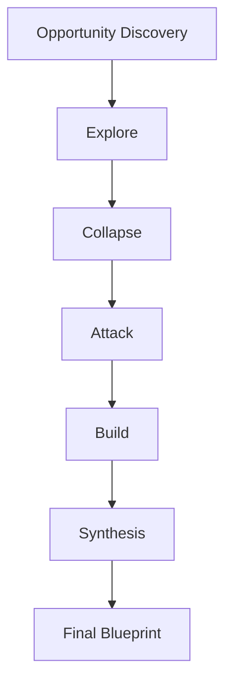

# MAS-ZERO Architecture

> The high-fidelity dialectic engine powering the Digital Twin Venture Lab.

## Overview

The MAS-ZERO (Multi-Agent System Zero-Cost) architecture is designed to minimize operational overhead while maximizing critical thinking and simulation depth. It operates on a **Local-First** principle, leveraging local LLMs (via Ollama) and PocketBase for state management.

***

## The 5 Stages of Consensus

Every business opportunity undergoes a rigorous 5-stage dialectic process:

### 1. Stage: Explore (Creative Expansion)
- **Agents**: Trend Hunter, Niche Specialist, Tech Scout.
- **Goal**: Expand the raw idea into multiple viable architectures and market positions.

### 2. Stage: Collapse (Practical Reduction)
- **Agents**: Cost Controller, Reality Check, Complexity Auditor.
- **Goal**: Filter out ideas that violate the **Zero-Cost Strategy** or are too complex for initial MVP.

### 3. Stage: Attack (Fragility Testing)
- **Agents**: Devil's Advocate, Competitor Spy, User Friction Hunter.
- **Goal**: Aggressively find failure modes. This stage generates the **Fragility Map**.

### 4. Stage: Build (Execution Plan)
- **Agents**: Architect, Implementer, QA Agent.
- **Goal**: Draft the technical execution plan, file structure, and dependency list.

### 5. Stage: Synthesis (CEO Review)
- **Agents**: Consensus CEO.
- **Goal**: Final verdict. If disagreement exists, the CEO enforces a pivot or a restart.

***

## Data Flow & Memory Graph

The Digital Twin uses a **Recursive Memory Graph** to ensure it learns from past venture failures:

1. **Venture Failure** -> Logged to `facts` collection.
2. **Next Cycle** -> `Trend Hunter` recalls past failures as constraints.
3. **Refinement** -> The system avoids the same "cracks" identified in previous Fragility Maps.

***

## Security & Sovereignty

- **Network**: Air-gapped capable (when using local Ollama).
- **Encryption**: Data stored locally in PocketBase with optional volume encryption.
- **Sidecar**: Go sidecars communicate over local unix sockets / localhost for maximum isolation.
