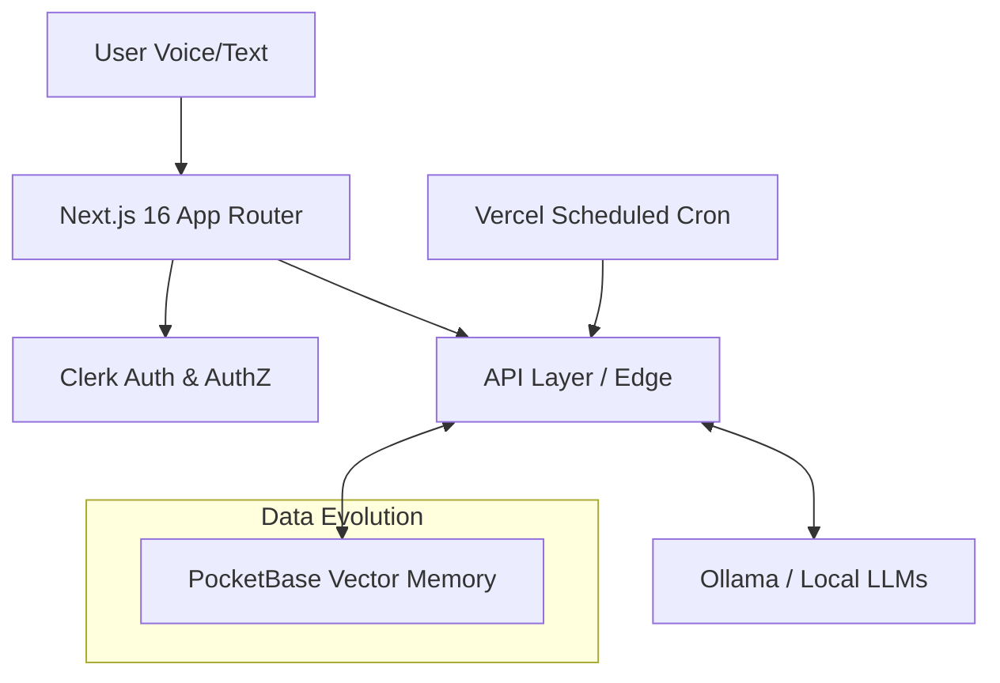

# DigitalMiniTwin

> A cinematic full-stack AI digital twin with memory, adaptive learning, local LLM support, and immersive Sci-Fi UI.


---

## 🚀 Demo

- **Live App:** [https://digital-mini-twin.vercel.app](https://digital-mini-twin.vercel.app)
- **Preview Builds:** Vercel auto-deployments configured.

<!-- TO CAPTURE: Please capture a short dashboard demo GIF and place it in docs/demo/dashboard-demo.gif -->


## 🌌 Why this project?

DigitalMiniTwin is an entirely locally-adaptable, AI-first personal twin platform designed to:
- Learn natively from iterative conversations.
- Preserve contextual memory and decay irrelevant facts over time.
- Evolve its persona tone, behaving like a mirror of the user.
- Eliminate dependency on high-cost cloud APIs by supporting **local-first intelligence** (Ollama/Gemma / WebLLM).
- Deliver a premium, uncompromised "Cyber-Clinical" UI featuring real-time audio visualization, matrix rains, and glassmorphism.

---

## 🛠 Features

- **Security & Identity:** Clerk Auth with layered Canvas background protection.
- **Data Persistence:** PocketBase edge storage layer.
- **Cognitive Agentic Core:** Ollama / Gemma capabilities directly accessible via LangChain.
- **Bi-Directional Memory Engine:** Long-term memory extraction + daily cron decay algorithms.
- **Voice Bridge Readiness:** LiveKit real-time audio connection endpoints baked in.
- **Immersive Dashboards:** Magnetic cursor interactions, typing terminals, tool execution accordions, and CSS 3D Holograms.

---

## 📐 Architecture Flow



---

## 📸 Interface Gallery

### 1. Welcome to the Void (Landing)
<!-- TO CAPTURE: Please capture landing.png and place it in docs/images/landing.png -->


### 2. Neural Handshake (Auth)
<!-- TO CAPTURE: Please capture auth.png and place it in docs/images/auth.png -->


### 3. Command Dashboard
<!-- TO CAPTURE: Please capture dashboard.png and place it in docs/images/dashboard.png -->


### 4. Memory Evolution Matrix
<!-- TO CAPTURE: Please capture memory.png and place it in docs/images/memory.png -->


---

## 💻 Tech Stack

| Layer | Technology |
|---|---|
| **Frontend Framework** | Next.js 16 (App Router), React 19, TypeScript |
| **Styling & UI UX** | Tailwind CSS v4, Motion (Framer), Vanilla CSS System |
| **Authentication** | Clerk Auth Hub |
| **Database & Vector** | PocketBase |
| **Local AI Node** | Ollama + Gemma 4 |
| **Hosting & Automation**| Vercel + Vercel Cron Jobs |

---

## ⚡ Getting Started

### 1. Clone the repository
```bash
git clone https://github.com/Moeabdelaziz007/digitaltwin-local-agent.git
cd digitaltwin-local-agent
```

### 2. Install Dependencies
```bash
npm install
```

### 3. Configure the Environment
```bash
cp .env.example .env.local
```
*(Review the Environment Variables table below and fill in the required keys in `.env.local`)*

### 4. Launch the Neural Link
```bash
npm run dev
```

---

## 🔑 Environment Variables

| Variable | Required | Purpose |
|---|---|---|
| `POCKETBASE_URL` | Yes | Server-side PocketBase URL for API routes and memory engine |
| `CLERK_SECRET_KEY` | Yes | Clerk server auth secret |
| `NEXT_PUBLIC_CLERK_PUBLISHABLE_KEY` | Yes | Clerk client publishable key |
| `CLERK_WEBHOOK_SECRET` | Yes | Signature verification for `/api/webhooks/clerk` |
| `SIDECAR_URL` | Yes | Reflection sidecar base URL used by `/api/conversation` |
| `SIDECAR_SHARED_SECRET` | Yes | Shared secret between app and sidecar services |
| `CRON_SECRET` | Yes | Bearer secret required by `/api/cron/*` routes |
| `NEXT_PUBLIC_POCKETBASE_URL` | No | Optional client-facing PocketBase URL override |
| `OLLAMA_URL` | No | Optional Ollama API URL (defaults to local) |
| `OLLAMA_MODEL` | No | Optional default LLM model name |
| `LIVEKIT_URL` | No | LiveKit websocket URL for voice token generation |
| `LIVEKIT_API_KEY` | No | LiveKit API key for server-side token minting |
| `LIVEKIT_API_SECRET` | No | LiveKit API secret for server-side token minting |
| `NEXT_PUBLIC_LIVEKIT_URL` | No | Optional LiveKit URL fallback on the client |
| `NEXT_PUBLIC_SENTRY_DSN` | No | Optional browser-side Sentry DSN |

---

## ⚠️ Troubleshooting

<details>
<summary><b>1. Build constantly fails on Vercel</b></summary>
<br/>

- Run `npx tsc --noEmit` locally first. Next.js 16 enforces strict TypeScript definitions.
- Ensure you commit all fixes before deploying. If `npm run build` fails locally, it will fail on Vercel.
- Verify environment variables exist globally within your Vercel Project Dashboard.
</details>

<details>
<summary><b>2. Cron job rejects PocketBase connection</b></summary>
<br/>

Never use `http://127.0.0.1:8090` in production. Always substitute with a live/hosted `POCKETBASE_URL`.
</details>

<details>
<summary><b>3. LiveKit Audio not connecting</b></summary>
<br/>

Ensure your `LIVEKIT_API_KEY` and `LIVEKIT_API_SECRET` are correct. Do NOT expose `LIVEKIT_API_SECRET` to the frontend config.
</details>

---

## 🗺 Roadmap

- [x] Contextual memory engine & abstraction layer
- [x] Dynamic semantic extraction automation
- [x] Full Clerk identity & session security implementation
- [x] Stitch-Inspired UI/UX overhaul (Cinematic / Clinical Cyberpunk Pattern)
- [ ] LiveKit edge deployment logic refinement
- [ ] Fully visual Memory Map / Canvas interface
- [ ] Hardware integration APIs (IOT / Wearable twin communication)
- [ ] Admin Observability panel

---

## 🛠 Contributing
Pull Requests, diagnostic bug reports, and architectural proposals are actively welcome. Ensure you test UX regressions running the script:
`npm run scan-bugs` before proposing merges.

## 📄 License
This project operates under the [MIT License](LICENSE).
