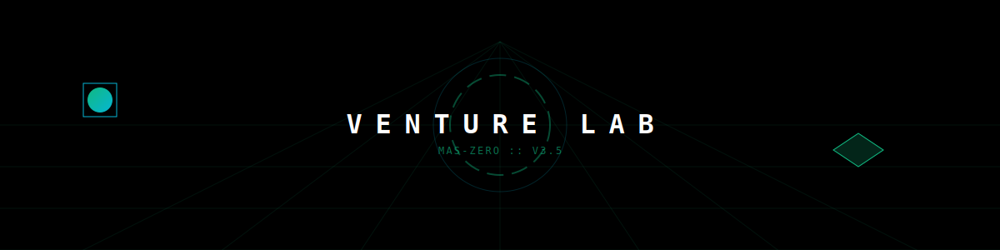

<p align="center">
  
</p>

<p align="center">
  
</p>

<p align="center">
  <a href="https://github.com/Moeabdelaziz007/digitaltwin-local-agent/actions/workflows/ci.yml">
    
  </a>
  
  
  
  
</p>

<h1 align="center">
  MAS-ZERO: The Twin that Works
</h1>

<p align="center">
  <i>From Mimetic Companion to Autonomous Venture Powerhouse</i>
  <br/>
  من مساعد شخصي إلى قوة مشاريع ذاتية التشغيل
</p>

***

## 📑 Table of Contents | الفهرس
- [Vision](#-vision--الرؤية)
- [Quick Start](#-quick-start--ابدأ-هنا)
- [Requirements](#-requirements--المتطلبات)
- [Architecture](#-architecture--البناء-التقني)
- [MAS-ZERO Engine](#-core-engine-mas-zero--المحرك-الجوهري)
- [Credits](#-credits--المساهمون)

***

## 🌐 Vision | الرؤية: The Twin that Works

<table width="100%">
  <tr>
    <td width="50%" valign="top">
      <h3>English</h3>
      <p><b>MAS-ZERO: The Twin that Works</b> is a strategic pivot from simple mimicry to autonomous production. It uses your digital footprint (Companion Layer) as a contextual compass while the 14-agent <b>Venture Lab</b> handles the heavy lifting: identifying arbitrage, building Micro-SaaS, and orchestrating revenue.</p>
    </td>
    <td width="50%" valign="top" align="right" dir="rtl">
      <h3>العربية</h3>
      <p><b>ماس-زيرو: التوأم الذي يعمل</b> هو تحول استراتيجي من مجرد المحاكاة إلى الإنتاج الذاتي. يستخدم بصمتك الرقمية (طبقة المرافق) كبوصلة سياقية، بينما يتولى <b>مختبر المشاريع</b> المكون من 14 وكيلاً العمل الشاق: اكتشاف الفرص، بناء المشاريع الصغيرة، وتنظيم الإيرادات.</p>
    </td>
  </tr>
</table>

### 🏗️ Architectural Hierarchy | التدرج المعماري
1.  **Executive Layer (The Synapse)**: The neural orchestrator (core-orchestrator).
2.  **Intelligence Layer (The Crucible)**: 14-agent consensus engine (consensus-engine-v3).
3.  **Action Layer (The Kinetic Edge)**: The execution sharp-end (action-executor).
4.  **Simulation Layer (The Future Mirror)**: Monte Carlo "What-if" market simulations.
5.  **Search Layer (The Prism)**: Market refraction & Jina-powered opportunity scanning.
6.  **Protection Layer (The Privacy Filter)**: Local RAG gatekeeper & Sovereign Shield quality gate.
7.  **Structure Layer (The Neural Hierarchy)**: Hierarchical task distribution tree.
8.  **Memory Layer (The Chronos Ledger)**: Causal attribution & MemGPT-style tiered memory.
9.  **Evolution Layer (The Alchemist)**: Meta-cognitive reflection & recursive skill-scaffolding.
10. **Input Layer (The Companion)**: User persona & Desktop Bridge context.

***

## 🛡️ Sovereign Upgrades | الترقيات السيادية (v3.5+)
The system has been hardened with cutting-edge agentic infrastructure:

-   **[The Sovereign Shield]**: A strict quality gate (`npm run verify`) that enforces zero-drift between DB schema and code via auto-generated contracts.
-   **[Tiered Memory Store]**: Implements MemGPT-style memory (Hot/Warm/Cold) with auto-compaction and LLM-driven summarization to manage infinite context.
-   **[Opportunity Scanner]**: Real-time signal detection across Upwork, Contra, and IndieHackers using **Jina Reader** refraction.
-   **[Meta-Cognitive Engine]**: A self-improvement loop that analyzes task outcomes to update skill weights and generate new hypotheses.
-   **[Causal Attribution]**: Tracks the "Why" behind successes/failures to build a personalized context moat.
-   **[Desktop Bridge (Sidecar)]**: Screen-aware proactive intelligence using `screenshot-desktop` and zero-cost OCR.
-   **[Skill Marketplace]**: NPM-style skill packages with semantic versioning and auto-tracking performance stats.

***

### 💰 Hidden Revenue Strategies | استراتيجيات الربح المخفية
-   **Income Stream 1: [Autonomous Freelance Agent]**: Automated Upwork/Contra job hunting. Uses Jina Reader for signal fetching and Digital Twin voice for proposal generation.
-   **Income Stream 2: [Content Arbitrage Machine]**: Monitors trending tech keywords, writes SEO-optimized articles with embedded affiliate links (Vercel, GitHub, Notion), and auto-posts to Medium/Hashnode/Dev.to.
-   **Income Stream 3: [Micro-SaaS Idea Validator + Builder]**: Automatically identifies high-ROI problems, generates a minimal Next.js/API solution, creates a Gumroad listing, and deploys to Vercel.
-   **Income Stream 4: [GitHub Issue Bounty Hunter]**: Scans for open-source issues with bounties ($50-$500), solves them autonomously using the SWE-agent pattern, and submits PRs.
-   **Income Stream 5: [Digital Product Factory]**: Audits internal memory for reusable knowledge and packages it into sellable assets (Templates, Prompt Packs, AI Workflows).
-   **Income Stream 6: [Agent-as-a-Service]**: Monetize the Twin's intelligence by exposing the `opportunity/` and `causal/` engines as a paid API for other developers.
-   **The Arbitrage Mirror**: Uses *The Prism* to simulate causal patterns of high-performance On-chain wallets.
-   **Fragility Hunting**: Identify weaknesses in Micro-SaaS projects to build "Fixed" versions.
-   **Memory Monetization**: Synthesis of *Chronos Ledger* into high-value "Alpha Reports".

***

## ⚡ Quick Start | ابدأ هنا

```bash
# 1. Clone the Sovereign Engine
git clone https://github.com/Moeabdelaziz007/digitaltwin-local-agent.git
cd digitaltwin-local-agent

# 2. Install Dependencies
npm install

# 3. Setup Environment
cp .env.example .env.local

# 4. Pull Local Intelligence (Ollama required)
ollama pull qwen2.5:3b

# 5. Launch the Lab
npm run dev
```

***

## 📋 Requirements | المتطلبات
- **Node.js**: >= 20.11.1
- **Package Manager**: npm or pnpm
- **Local LLM Runtime**: [Ollama](https://ollama.ai/)
- **Database**: PocketBase (embedded)
- **Auth**: Clerk (configured in .env)

***

## 📐 Architecture | البناء التقني

```text
  [ User Interface ] <---> [ Next.js 15 (App Router) ]
                                 |
                                 v
  [ Go Sidecars ] <------> [ MAS-ZERO Engine ] <------> [ Local LLM (Ollama) ]
                                 | (Causal Reasoning)
                                 v
                         [ PocketBase (DB) ]
```

- **Frontend**: React 19, Framer Motion, Tailwind 4.
- **Sidecar**: High-performance Go services for atomic actions.
- **Observability**: OpenTelemetry + Arize Phoenix for tracing.

***

## 🚀 Core Engine: MAS-ZERO | المحرك الجوهري

<details open>
<summary><b>Dialectic Multi-Agent Architecture | هندسة الوكلاء المتعددة</b></summary>

The system employs a consensus loop to pressure-test every opportunity. Use the **[IDEA:]** prefix in any message to force-trigger the **Venture Lab** cycle.

يعتمد النظام على حلقة إجماع لاختبار كل فرصة. استخدم البادئة **[IDEA:]** في أي رسالة لتفعيل دورة **مختبر المشاريع** قسرياً.

| Agent | Role | الدور |
| :--- | :--- | :--- |
| **Meta-Architect** | Workflow Design | تصميم سير العمل |
| **Devil's Advocate** | Fragility Analysis | تحليل نقاط الضعف |
| **Revenue Architect** | Profit Simulation | محاكاة الأرباح |
| **Distribution Scout** | Growth Loops | حلقات النمو |
| **CEO Orchestrator** | Final Synthesis | التوليف النهائي |
| **Sidecar Observer** | Desktop Intelligence | ذكاء سطح المكتب |

</details>

***

## 🏪 The Skill Marketplace | متجر المهارات
MAS-ZERO treats skills as **Sovereign NPM-style packages**:
-   **Semantic Versioning**: Track evolution from `v1.0.0` to `v2.1.0`.
-   **Auto-Publishing**: Skills with >80% success rate automatically enter the internal marketplace.
-   **Performance Metrics**: Real-time tracking of `totalRuns`, `avgDurationMs`, and `earningsGenerated`.

## 🖥️ Desktop Bridge (Sidecar) | جسر سطح المكتب
The agent is no longer blind. Using the `sidecar/` module:
-   **Proactive Observation**: OCR-powered screen analysis via `tesseract.js`.
-   **Context-Aware Help**: "I see you're looking at a TypeScript error. Want me to fix it?"
-   **Zero-Cost Engineering**: Pure open-source stack (Screenshot-desktop + Tesseract) running locally.

***

## 👤 Credits | المساهمون

<table width="100%">
  <tr>
    <td align="center" width="100%">
      <a href="https://github.com/Moeabdelaziz007">
        
        <br />
        <sub><b>Moe Abdelaziz (@Moeabdelaziz007)</b></sub>
      </a>
      <br />
      Principal AI Engineer & System Architect
    </td>
  </tr>
</table>

***

<p align="center">
  <i>Engineered for Profit. Optimized for Sovereignty.</i>
  <br/>
  <b>2026 Venture Lab :: MAS-ZERO v0.01</b>
  <br/>
  <a href="ARCHITECTURE.md">Architecture</a> • <a href="ROADMAP.md">Roadmap</a> • <a href="AGENTS.md">Agents</a>
</p>
