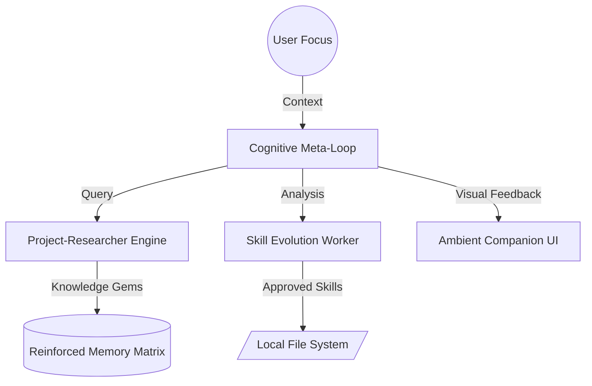

<div align="center">
  
  
  # 🧬 DIGITAL MINI TWIN
  ### [EN] The Sovereign AI Consciousness | [AR] الوعي الرقمي السيادي
</div>

---

---

[  ](https://github.com/Moeabdelaziz007/digitaltwin-local-agent)
[  ](https://nextjs.org)
[  ](https://ollama.com)
[  ](LICENSE.md)

---

## 🌌 The Vision / الرؤية

**[EN]** DigitalTwin is more than a chatbot; it is a persistent cognitive layer designed to evolve with its user. By combining **local-first intelligence** (Ollama) with an **autonomous meta-loop**, it transforms every conversation turn into reinforced memory or reusable procedural skills.

**[AR]** مشروع "التوأم الرقمي" هو أكثر من مجرد روبوت دردشة؛ إنه طبقة إدراكية مستمرة مصممة لتتطور مع مستخدمها. من خلال الجمع بين **الذكاء المحلي الأول** (Ollama) و**حلقة الميتا المستقلة**، فإنه يحول كل محادثة إلى ذاكرة معززة أو مهارات إجرائية قابلة لإعادة الاستخدام.

---

## 🚀 The Cognitive Meta-Loop / الحلقة الإدراكية الكبرى

| Component / المكون | EN: Primary Function | AR: الوظيفة الأساسية |
| :--- | :--- | :--- |
| **Researcher Engine** | Automated ingestion of "Knowledge Gems" from arXiv & GitHub. | جلب "الجواهر المعرفية" تلقائياً من arXiv و GitHub. |
| **Skill Evolution** | Generalizing successful interaction traces into code-based skills. | تحويل تفاعلاتك الناجحة إلى مهارات برمجية قابلة للتكرار. |
| **Deep Reflection** | Periodic batch analysis to detect persona drift and demote stale facts. | تحليل دوري لاكتشاف انحراف الشخصية وإلغاء الحقائق القديمة. |
| **Ambient Aura** | Immersive Sci-Fi UI that visualizes internal cognitive states. | واجهة خيال علمي غامرة تصور الحالات الإدراكية الداخلية. |

---

## 📐 Architecture / الهندسة المعمارية



---

## 🧠 Core Engineering / الهندسة الجوهرية

- **[EN] Hybrid Memory Engine**: Implements Ebbinghaus-inspired decay models and semantic deduplication using `all-minilm`.
- **[AR] محرك الذاكرة الهجين**: يطبق نماذج تلاشي مستوحاة من منحنى "إبنجهاوس" وإزالة التكرار الدلالي باستخدام `all-minilm`.
- **[EN] Trusted Sidecars**: A high-performance Go-based orchestration layer handles background processing, secured via HMAC-SHA256.
- **[AR] الـ Sidecars الموثوقة**: طبقة تنسيق عالية الأداء مبنية بلغة Go تتعامل مع العمليات الخلفية، مؤمنة بتوقيعات HMAC-SHA256.
- **[EN] Atomic Persistence**: Idempotent turn tracking ensures zero data loss and prevents race conditions.
- **[AR] الاستمرارية الذرية**: تتبع المحادثات بشكل فريد (Idempotent) يضمن عدم فقدان البيانات ومنع تداخل العمليات.

---

## 🛠 Tech Stack / المكونات التقنية

- **Frontend**: Next.js 15 (App Router), Tailwind CSS v4, Motion (Framer).
- **Backend Orchestrator**: Go 1.22 (Job Workers & Audio Streams).
- **Intelligence**: Ollama (Llama 3 / Gemma 4), all-minilm vector embeddings.
- **Database**: PocketBase (Local SQLite-based persistence).
- **Auth**: Clerk (Identity Management & Session Security).

---

## ⚡ Quick Start / البدء السريع

### 1. Initialize Neural Link / تهيئة الرابط العصبي
```bash
git clone https://github.com/Moeabdelaziz007/digitaltwin-local-agent.git
cd digitaltwin-local-agent
pnpm install
```

### 2. Infrastructure Setup / إعداد البنية التحتية
```bash
# Copy environment template
cp .env.example .env.local

# Run architectural verification
pnpm verify
```

### 3. LiveKit Env Naming (Unified) / توحيد اسم متغير LiveKit
- Use only `NEXT_PUBLIC_LIVEKIT_URL` for the LiveKit websocket URL (client + server token route).
- Do not use `LIVEKIT_URL`.

> [!TIP]
> **Vercel Build Fix / إصلاح بناء فيرسل**:
> To resolve `cli with get core cause` errors, ensure `ENABLE_COREPACK=1` is set in your Vercel Dashboard env vars.
> لإصلاح أخطاء بناء فيرسل، تأكد من تعيين `ENABLE_COREPACK=1` في المتغيرات البيئية للوحة التحكم.

---

## 🗺 Roadmap / خارطة الطريق

- [x] Contextual memory reinforcement / تعزيز الذاكرة السياقية
- [x] HMAC-signed Sidecar security bridge / جسر أمان مشفر للعمليات الخلفية
- [x] Cognitive Meta Loop (Research + Evolution) / الحلقة الإدراكية الكبرى (البحث + التطور)
- [ ] **Phase 4**: Fully visual Memory Map / Canvas interface / واجهة بصرية كاملة لخريطة الذاكرة
- [ ] **Phase 5**: Advanced Collaborative Mode / وضع التعاون المتقدم

---

## 🛠 Safety & Ethics / الأمان والأخلاقيات

[EN] DigitalTwin is designed for **privacy and sovereignty**. All neural weights and memories reside on your local node. No data is sent to external parties without your explicit approval via the Work Report.

[AR] تم تصميم التوأم الرقمي من أجل **الخصوصية والسيادة الرقمية**. جميع بيانات الذاكرة والذكاء مخزنة محلياً. لا يتم إرسال أي بيانات لجهات خارجية دون موافقتك الصريحة عبر تقرير العمل.

---

## 📄 License / الترخيص
MIT License. Created by [Mohamed Hossameldin Abdelaziz](https://github.com/Moeabdelaziz007).
