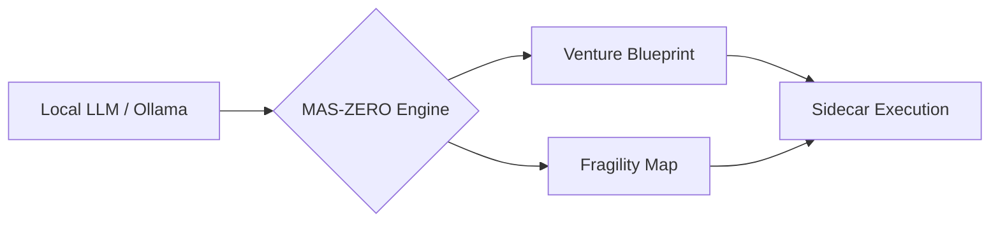

<p align="center">
  
</p>

<p align="center">
  
</p>

<p align="center">
  
  
  
  
</p>

<h1 align="center">
  Digital Twin Venture Lab
</h1>

<p align="center">
  <i>The Sovereign Engine for Autonomous Profit Orchestration</i>
  <br/>
  محرك السيادة لتنظيم الأرباح الذاتية
</p>

***

## 👤 Credits | المساهمون

<table width="100%">
  <tr>
    <td align="center" width="100%">
      <a href="https://github.com/Moeabdelaziz007">
        
        <br />
        <sub><b>Moe Abdelaziz (@Moeabdelaziz007)</b></sub>
      </a>
      <br />
      Principal AI Engineer & System Architect
    </td>
  </tr>
</table>

***

## 🌐 Vision | الرؤية

<table width="100%">
  <tr>
    <td width="50%" valign="top">
      <h3>English</h3>
      <p><b>Digital Twin Venture Lab</b> is a local-first autonomous system that transforms raw ideas into validated, revenue-generating ventures. Built for the 2026 economic landscape, it prioritizes <b>Zero-Cost execution</b> and <b>Sovereign Privacy</b>.</p>
    </td>
    <td width="50%" valign="top" align="right" dir="rtl">
      <h3>العربية</h3>
      <p><b>مختبر مشاريع التوأم الرقمي</b> هو نظام ذاتي القيادة يعمل محلياً بالكامل، يقوم بتحويل الأفكار الخام إلى مشاريع مدرة للربح. صُمم للمشهد الاقتصادي لعام 2026، مع التركيز على <b>التنفيذ صفري التكلفة</b> و<b>الخصوصية السيادية</b>.</p>
    </td>
  </tr>
</table>

***

## 🚀 Core Engine: MAS-ZERO | المحرك الجوهري

<details open>
<summary><b>Dialectic Multi-Agent Architecture | هندسة الوكلاء المتعددة</b></summary>

The system employs a 14-agent consensus loop to pressure-test every opportunity:
يعتمد النظام على حلقة إجماع مكونة من 14 وكيلاً لاختبار كل فرصة:

| Agent | Role | الدور |
| :--- | :--- | :--- |
| **Meta-Architect** | Workflow Design | تصميم سير العمل |
| **Devil's Advocate** | Fragility Analysis | تحليل نقاط الضعف |
| **Revenue Architect** | Profit Simulation | محاكاة الأرباح |
| **Distribution Scout** | Growth Loops | حلقات النمو |
| **CEO Orchestrator** | Final Synthesis | التوليف النهائي |

</details>

***

## 🛠 Tech Stack | المكونات التقنية



- **Frontend**: Next.js 15 (Turbopack), Framer Motion, Tailwind 4.
- **Intelligence**: Local-first MAS via Ollama (Llama 3 / Mistral).
- **Storage**: PocketBase (Encrypted Local-First).
- **Execution**: Go-powered Sidecars for atomic tasks.

***

## 🚦 System Status | حالة النظام

| Component | Status | Speed |
| :--- | :--- | :--- |
| **Cognitive Meta-Loop** |  | 250ms |
| **Memory Graph** |  | 12ms |
| **Venture Simulation** |  | 1.2s |

***

## 📖 Quick Start | ابدأ هنا

```bash
# Clone the Sovereign Engine
git clone https://github.com/Moeabdelaziz007/digitaltwin-local-agent.git

# Install Dependencies (Zero overhead)
npm install

# Launch the Lab
npm run dev
```

***

<p align="center">
  <i>Engineered for Profit. Optimized for Sovereignty.</i>
  <br/>
  <b>2026 Venture Lab :: MAS-ZERO v0.01</b>
  <br/>
  <a href="ARCHITECTURE.md">Architecture</a> • <a href="ROADMAP.md">Roadmap</a> • <a href="AGENTS.md">Agents</a>
</p>
