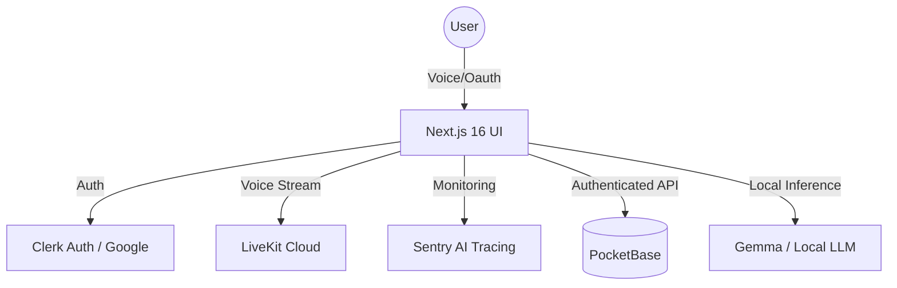

# DigitalMiniTwin 🛸 v2.1

**Architecting a Secure, Immersive, Voice-First AI Digital Twin. Hardened for Production.**

<!-- START_BADGES -->


<!-- END_BADGES -->

## ⚡ The Vision
DigitalMiniTwin is a **Presence Layer** for your digital life. It has evolved from a simple chatbot into a high-fidelity digital consciousness that observes, reflects, and reacts in an immersive environment.

- **Observe**: Real-time WebRTC voice capture with LiveKit.
- **Propose**: Intelligent, non-intrusive action suggestions via Ollama.
- **Immerse**: A state-of-the-art Industrial Sci-Fi UI featuring 3D CSS Holograms and Neural Particle backgrounds.

---

## 🏗️ Architecture (V2)
The V2 architecture prioritizes **Identity Resilience** and **Low-Latency Voice**.



---

## 🌎 Overview
A state-of-the-art, local-intelligence AI digital twin platform. It features a private voice-first pipeline, an immersive **Industrial Sci-Fi design system**, and a production-grade identity layer via Clerk. Built to protect privacy while providing a high-fidelity "Presence Layer", it integrates Sentry for automated diagnostics and LiveKit for zero-latency voice interaction.

## 🌍 نظرة عامة
منصة توأم رقمي ذكي متطورة تدمج الذكاء المحلي مع تجربة مستخدم سيبرانية غامرة. يتميز المشروع بنظام تصميم "Industrial Sci-Fi" المتقدم، وطبقة حضور صوتي فورية عبر LiveKit، مع تأمين كامل للهوية عبر Clerk. صُمم النظام ليكون جاهزاً للإنتاج مع مراقبة استباقية للأخطاء عبر Sentry، مما يضمن أداءً مستقراً وخصوصية مطلقة.

---

## 💎 Key Features (V2.1 Hardened)
- **Immersive Auth (New)**: Cyberpunk-themed login with Matrix rain and particle canvas backgrounds.
- **Google OAuth Integration**: Seamless onboarding via Clerk.
- **Real-time Voice Bridge**: Low-latency bidirectional voice via LiveKit Cloud.
- **Holographic Dashboard**: A reactive 3D Hologram stage that visualizes voice states (Listening, Speaking).
- **Proactive Diagnostics**: Sentry-powered error boundaries and diagnostic API (/api/sentry-test).
- **Cognitive Memory Architecture**: 
  - **Memory Decay**: Simulated forgetting curve for relevant fact retention.
  - **Automated Snapshots**: Periodic long-term memory aggregation.

---

## 🛠️ Quick Start

### 1. Requirements
- macOS (M1/M2/M3 recommended) or Linux.
- [Ollama](https://ollama.ai/) (Running `gemma` or your preferred model).
- [PocketBase](https://pocketbase.io/) (Data Layer).
- [LiveKit Cloud](https://cloud.livekit.io) (Voice Infrastructure).
- [Clerk](https://clerk.com) (Identity Provider).

### 2. Setup
```bash
# 1. Install Dependencies
npm install

# 2. Configure Environment (.env.local)
NEXT_PUBLIC_CLERK_PUBLISHABLE_KEY=...
CLERK_SECRET_KEY=...
LIVEKIT_URL=...
LIVEKIT_API_KEY=...
LIVEKIT_API_SECRET=...
NEXT_PUBLIC_SENTRY_DSN=...
POCKETBASE_URL=http://localhost:8090
OLLAMA_URL=http://localhost:11434

# 3. Launch Industrial Sci-Fi Environment
npm run build
npm run start
```

---

## 🛰️ Diagnostic Workflow
DigitalMiniTwin 2.1 includes a built-in diagnostic layer:
- **Scan**: Automated code auditing via `src/lib/debug.ts`.
- **Verify**: Trigger a system test via `GET /api/sentry-test`.
- **Catch**: Global Error Boundaries capture render-time failures on the fly.

---

## 📂 Project Structure
- `src/app/`: Next.js App Router (Dashboard, Auth, Onboarding).
- `src/components/`: High-fidelity UI components (FloatingOrb, VoiceBridge, LoginBackground).
- `src/lib/`: Core logic (Ollama, PocketBase, Sentry Logger).
- `src/styles/`: Design System tokens (design-system.css, globals.css).

---

## 🤝 Contributing
Lead the future of digital presence. See [CONTRIBUTING.md](./docs/CONTRIBUTING.md).

## 📄 License
MIT License - Copyright (c) 2026 **Mohamed Hossameldin Abdelaziz** (@Moeabdelaziz007)
