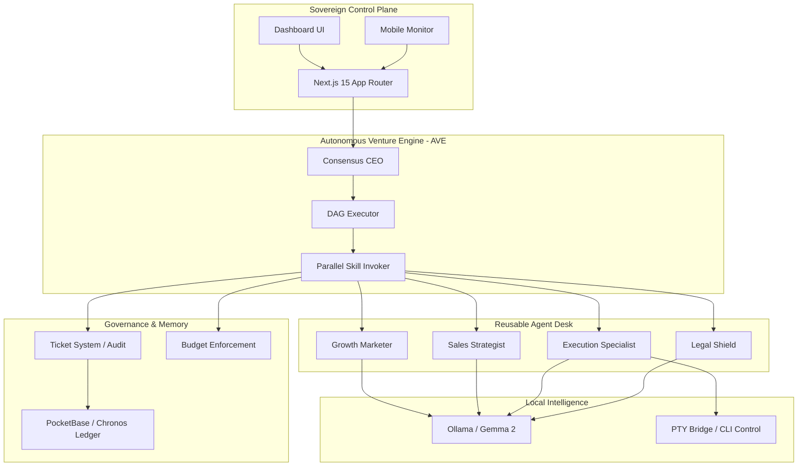

<p align="center">
  
</p>

<p align="center">
  <a href="#-quickstart">Quickstart</a> · <a href="docs/SYSTEM_DESIGN_AHP.md">Docs</a> · <a href="https://github.com/Moeabdelaziz007/digitaltwin-local-agent">GitHub</a> · <a href="#-credits">Credits</a>
</p>

<p align="center">
  <b>🚀 Status: Operational Alpha (v1.1.0)</b><br/>
  <b>MIT License · ★ 2.4k · Active Development</b>
</p>

<p align="center">
  
  
  
  
</p>

***

# 🤖 MAS-ZERO: The Autonomous Holding Protocol
### *Open-Source Orchestration for Zero-Human Venture Portfolios*
### *أوركسترا مفتوحة المصدر لإدارة محافظ المشاريع ذاتية التشغيل*

**If OpenClaw is an employee, MAS-ZERO is the Holding.**  
**إذا كان OpenClaw هو الموظف، فإن MAS-ZERO هو الشركة القابضة.**

MAS-ZERO is a Next.js 15 powerhouse that orchestrates a team of specialized AI agents to run entire businesses. It’s not just a chatbot—under the hood, it features parallel DAG execution, immutable governance, budget enforcement, and a unified command plane for your entire venture portfolio.

---

## ⚡ Step-by-Step Logic | آلية العمل

| Step | Action | English | العربية |
| :--- | :--- | :--- | :--- |
| **01** | **Define** | Identify a market gap (e.g., "AI-Powered SEO tool"). | تحديد ثغرة في السوق (مثلاً: أداة سيو مدعومة بالذكاء الاصطناعي) |
| **02** | **Hire** | Deploy CEO, Marketers, Engineers, and Sales agents. | توظيف الفريق: مدير، مسوق، مهندس، ومسؤول مبيعات |
| **03** | **Run** | Approve strategy, set budgets, and hit **GO**. | اعتماد الاستراتيجية، تحديد الميزانية، ثم إطلاق التشغيل الآلي |

---

## 🏗️ Architecture | المعمارية التقنية



---

## ✨ Features | المميزات الذكية

- **🔌 Bring Your Own Agent**: Any runtime, one org chart. (OpenClaw, Claude Code, Codex).
- **🔌 وظف أي وكيل**: أي بيئة تشغيل، هيكل تنظيمي واحد (OpenClaw, Claude Code).
- **🎯 Goal Alignment**: Tasks trace back to the mission. No aimless loops.
- **🎯 محاذاة الأهداف**: كل مهمة ترتبط برؤية الشركة. لا حلقات مفرغة.
- **💰 Cost Control**: Hard limits on token budgets per venture.
- **💰 التحكم بالتكلفة**: حدود صارمة لميزانية الـ Tokens لكل شركة.
- **🛡️ Governance**: You are the board. Approve, override, or pause anytime.
- **🛡️ الحوكمة**: أنت مجلس الإدارة. وافق، عدل، أو أوقف التشغيل في أي وقت.
- **🏢 Multi-Venture**: One deployment, many companies. Complete isolation.
- **🏢 شركات متعددة**: بيئة واحدة، شركات كثيرة. عزل كامل للبيانات.
- **🧪 Market Simulation**: Agents spawn sub-agents to simulate audience reactions before execution.
- **🧪 محاكاة السوق**: الوكلاء يولدون وكلاء فرعيين لمحاكاة ردود فعل الجمهور قبل التنفيذ.
- **🌲 Workforce Wiki Tree**: Recursive agent hiring with automatic Markdown documentation (Wikis) for every hire.
- **🌲 الهيكل الشجري للويكي**: توظيف وكلاء متكرر مع توثيق تلقائي (Wiki) لكل عملية توظيف.

---

## 🛡️ The Golden Rules | القواعد الذهبية
MAS-ZERO follows the **Anthony David Adams** framework for high-integrity orchestration:

1.  **Start with Three**: We focus on the **Golden Trio** (CEO, Executor, Critic). Complexity is earned, not given.
2.  **Roles, Not Tools**: Every agent has a Title, Duties, Authority, and Boundaries.
3.  **3-Layer Budget**: Hard caps (100%), Soft warnings (80%), and per-agent limits.
4.  **Governance Maturity**: From "Manual Review" to "Exception-Only" autonomy.

***

## 🔐 PII Black-Hole | خصوصية سيادية
We don't just use regex. We use a **Local Intelligence Gatekeeper**:
- **Ollama-Powered Detection**: Every input is scanned locally before leaving your machine.
- **Local Fallback**: If PII is detected, the task is forced to run on local models (Gemma/Qwen) instead of external APIs.
- **Differential Privacy**: Sensitive data remains in your local "Black-Hole".

***

## 💰 The 6 Revenue Rivers | أنهار الدخل الستة

1.  **[Freelance Sniper]**: Scans platforms and drafts winning proposals.
2.  **[GitHub Bounty Hunter]**: Autonomous PR submission for bounties.
3.  **[Micro-SaaS Factory]**: Scaffolds and launches Next.js MVPs.
4.  **[Content Multiplier]**: Multi-platform SEO and social domination.
5.  **[Digital Product Factory]**: Converts knowledge into sellable assets.
6.  **[Agent-as-a-Service]**: Monetizes internal logic via managed APIs.

---

## 🚀 Quickstart | ابدأ هنا

```bash
# 1. Clone the Sovereign Engine
git clone https://github.com/Moeabdelaziz007/digitaltwin-local-agent.git
cd digitaltwin-local-agent

# 2. Install & Setup
npm install
cp .env.example .env.local

# 3. Pull Local Brain (Ollama)
ollama pull gemma2:9b

# 4. Launch the Holding Engine
npm run dev
```

---

## 👤 Credits | صاحب المشروع
<table width="100%">
  <tr>
    <td align="center" width="100%">
      <a href="https://github.com/Moeabdelaziz007">
        
        <br />
        <sub><b>Moe Abdelaziz (@Moeabdelaziz007)</b></sub>
      </a>
      <br />
      <b>Principal System Architect & AI Pioneer</b>
      <br />
      <i>"Building the future of autonomous value creation."</i>
      <br />
      <a href="https://github.com/Moeabdelaziz007">Follow on GitHub</a>
    </td>
  </tr>
</table>

---

## 🗺️ Roadmap | خريطة الطريق
- [x] Autonomous Venture Engine (AVE) Core
- [x] The 6 Revenue Rivers (Alpha)
- [x] Immutable Ticket System
- [ ] **MAXIMIZER MODE** (Self-scaling budgets)
- [ ] **Clipmart** (One-click company templates)
- [ ] **Desktop Bridge** (Screen-aware proactive help)

---

<p align="center">
  <i>Engineered for Profit. Optimized for Sovereignty.</i><br/>
  <b>2026 Venture Lab :: MAS-ZERO v1.1.0</b>
</p>
