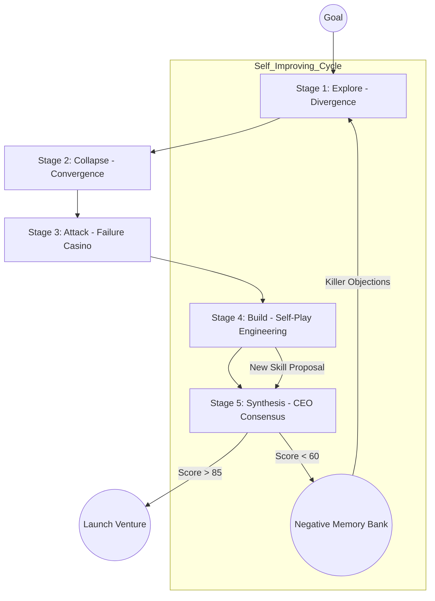

  
  
  # 🚀 DIGITAL TWIN: AUTONOMOUS VENTURE LAB (v3.0)
  ### [EN] Production-Grade Dialectic Lifecycle | [AR] مختبر المشاريع المستقل (إصدار 3.0)

---

---

## 🌌 The Vision / الرؤية

**[EN]** DigitalTwin v3.0 has transitioned from a personal assistant to a **Self-Operating Venture Lab**. Based on the **MAS-ZERO (2025)** framework, it utilizes a 5-stage **Dialectic Lifecycle** to identify, validate, and architect micro-ventures with **Zero Operational Cost**. It doesn't just "talk"—it simulates failures, builds architecture tournaments, and generates production-ready blueprints.

**[AR]** انتقل "التوأم الرقمي" في إصداره الثالث من مجرد مساعد شخصي إلى **مختبر مشاريع ذاتي التشغيل**. بناءً على إطار عمل **MAS-ZERO (2025)**، يستخدم النظام **دورة حياة جدلية** من 5 مراحل لتحديد، والتحقق من، وهندسة المشاريع الصغيرة بـ **تكلفة تشغيل صفرية**. هو لا يكتفي "بالحديث" فقط - بل يحاكي الفشل، ويجري بطولات هندسية، وينتج مخططات جاهزة للتنفيذ.

---

## 🏗️ The 5-Stage Dialectic Lifecycle

Our system operates in 5 constrained loops to ensure maximum ROI and resilience:

| Stage | Name | Function | Output |
| :--- | :--- | :--- | :--- |
| **1. Explore** | Divergence | Scout + Architect sense market gaps and trend anomalies. | 10 Directions |
| **2. Collapse** | Convergence | Selection Agent prunes the noise based on "Zero-Cost" feasibility. | Top 3 Ideas |
| **3. Attack** | The Crucible | Ghost Customer + Failure Casino stress-test the idea's fragility. | Fragility Map |
| **4. Build** | Self-Play | Implementer + Cost Controller conduct Architecture Tournaments. | Build Trace |
| **5. Synthesis**| Consensus | CEO Agent merges all traces into a definitive Venture Blueprint. | Final Alpha |

---

## 📐 Architecture / الهندسة المعمارية

---

## 🧠 v3.0 Core Innovations / الابتكارات الجوهرية

- **🎲 Failure Casino (Simulation)**: Stochastic scenario simulation to find "Black Swan" events that could kill a venture before deployment.
- **🏗️ Architecture Tournaments**: Competitive self-play between agents to find the most cost-effective technical stack.
- **🛡️ Fragility Mapping**: Quantitative risk assessment across market, tech, and distribution vectors.
- **⚡ Zero-Cost Mandate**: Strict auditing of every proposed step to ensure it runs on free-tier infrastructure (Vercel, Supabase, Ollama).
- **📝 Trace-Driven Execution**: Every decision is logged in an execution trace, allowing for human-in-the-loop verification of the agent's logic.

---

## 🛠 Safety & Sovereignty / الأمان والسيادة
Everything runs locally via **Ollama** and **PocketBase**. Your financial alpha is protected by local-first sovereignty. No third-party API dependencies required for core logic.

---

## 📄 License / الترخيص
MIT License. Part of the Autonomous Venture Lab Initiative.
