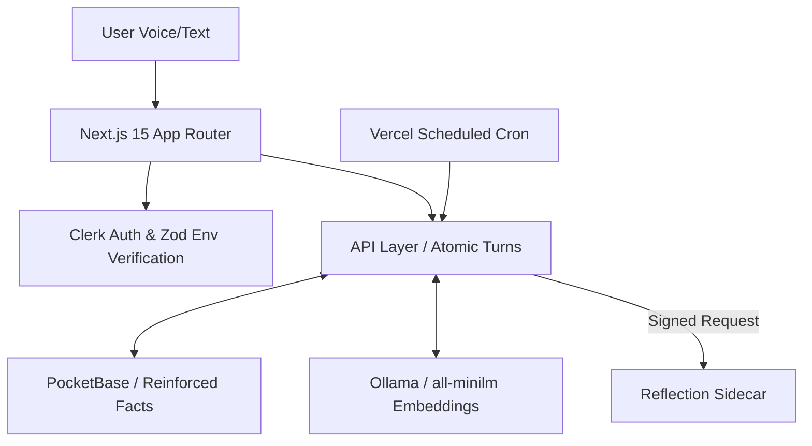

# DigitalMiniTwin

> A cinematic full-stack AI digital twin with memory, adaptive learning, local LLM support, and immersive Sci-Fi UI. Now hardened with atomic persistence and semantic deduplication.


---

## 🚀 Neural Infrastructure Hardening

We've recently upgraded the core architecture to move beyond a simple prototype into a **Production-Ready Sovereign Agent**:

### 🧠 Advanced Cognitive Memory Engine
- **Semantic Deduplication**: Uses vector embeddings (`all-minilm`) to detect identical or refined facts, preventing persona drift.
- **Categorical Reinforcement**: Implements an Ebbinghaus-inspired decay model where reinforced facts gain higher "neural stability".
- **Contradiction Handling**: Detects conflicting information and creates `fact_revisions` for cognitive reconciliation.

### 🛡️ Atomic Persistence & Security
- **Idempotent Conversation Turns**: Every chat cycle is tracked via a `Turn Envelope` (`conversation_turns` collection), preventing race conditions and duplicate writes.
- **Cryptographic Bridge**: Communication with the Reflection Sidecar is now secured via **HMAC-SHA256 signatures** and timestamped payloads.
- **SafeFetch Bridge**: Integrated automated retries and exponential backoff for all inter-service communication.

## 🌌 Neural Interface Demo

The DigitalMiniTwin platform features an immersive, motion-driven Sci-Fi interface designed for high-agency interaction.


*Cinematic Dashboard with Glassmorphism and holographic elements.*


*Real-time trace visualization for agent diagnostics.*

---

## 🍌 Nano Banana Pro: The Edge Brain

DigitalMiniTwin is designed for **Sovereign Edge Deployment**. The **Nano Banana Pro** represents our reference hardware architecture for a dedicated, local AI node.


*Concept: A dedicated local compute node running Ollama and PocketBase locally, providing zero-latency, private digital twin hosting.*

## 🐝 Observability & Tracing (Phase 1)

This project implements a production-grade observability layer using **OpenTelemetry (OTel)**. It provides end-to-end tracing across the Next.js API, Memory Engine, and Go sidecar.

### Tracing Architecture
- **Standard**: OpenTelemetry SDK (Portable & Vendor-neutral).
- **Store**: PocketBase `traces` collection (Local-first Phase 1).
- **Propagation**: W3C TraceContext over HTTP headers.
- **Admin UI**: Built-in dashboard at `/admin/observability`.

### Privacy-First Policy
To protect user data, the tracing layer **does not record raw prompts**. Instead, it captures "Prompt Shapes":
- **Message Metrics**: Role sequence, message count.
- **Volume Metrics**: Input/Output character counts.
- **Token Estimation**: 
  - `actual_*`: Real metrics from Ollama (if available).
  - `estimated_*`: Approximations (char count / 4).
- **Memory Context**: Record categories and IDs of retrieved memories only.

### How to use
Visit `/admin/observability` to view:
1. Recent execution traces.
2. Latency waterfall views.
3. Memory operation diagnostics.
4. Tool calling lifecycle.

---

## 🌌 Core Features

- **Security & Identity:** Clerk Auth with layered environment validation via Zod.
- **Cognitive Agentic Core:** Ollama / Gemma 4 with full support for autonomous tool calling.
- **Immersive Dashboards:** Magnetic cursor interactions, typing terminals, tool execution accordions, and CSS 3D Holograms.
- **Quality Gate:** Strict architectural enforcement via `npm run verify`.

---

## 📐 Architecture Flow



---

## 💻 Tech Stack

| Layer | Technology |
|---|---|
| **Frontend Framework** | Next.js 15 (Stable) / 16 (Ready), React 19 |
| **Styling & UI UX** | Tailwind CSS v4, Motion (Framer), Vanilla CSS System |
| **Verification** | Zod Environment Schema & Custom Performance Gates |
| **Database** | PocketBase (Memory + Turns + Sessions) |
| **Local AI Node** | Ollama + Gemma 4 / all-minilm |

---

## ⚡ Getting Started

### 1. Clone & Install
```bash
git clone https://github.com/Moeabdelaziz007/digitaltwin-local-agent.git
cd digitaltwin-local-agent
npm install
```

### 2. Configure Environment
```bash
cp .env.example .env.local
```
Ensure you provide `CLERK_WEBHOOK_SECRET` and `SIDECAR_SHARED_SECRET` for secure communication.

### 3. Verify Neural Integrity
```bash
npm run verify
```

### 4. Launch Link
```bash
npm run dev
```

---

## 🔑 Environment Variables

| Variable | Required | Purpose |
|---|---|---|
| `POCKETBASE_URL` | Yes | Server-side PocketBase URL |
| `CLERK_SECRET_KEY` | Yes | Clerk server auth secret |
| `CLERK_WEBHOOK_SECRET` | Yes | Signature verification for Clerk sync |
| `SIDECAR_SHARED_SECRET` | Yes | HMAC key for secured sidecar bridge |
| `OLLAMA_URL` | No | Neural link to local LLM node |

---

## ⚠️ Troubleshooting

<details>
<summary><b>1. Type Errors / Build Fails</b></summary>
<br/>

Run `npm run verify`. This script runs `tsc` and ensures all architectural guardrails (like `userId` checks) are present.
</details>

<details>
<summary><b>2. Memory Drift or Duplicate Facts</b></summary>
<br/>

The system now uses `all-minilm` for deduplication. Ensure your Ollama instance has the model pulled: `ollama pull all-minilm`.
</details>

---

## 🗺 Roadmap

- [x] Contextual memory reinforcement & semantic extraction
- [x] Atomic conversation cycles & Turn indexing
- [x] HMAC-signed Sidecar security bridge
- [x] Zod-based environment validation schema
- [ ] Fully visual Memory Map / Canvas interface
- [ ] Hardware integration for **Nano Banana Pro** wearables
- [ ] Admin Observability panel

---

## 🛠 Contributing
Ensure you run `npm run verify` before proposing any architectural merges.

## 📄 License
MIT License.

