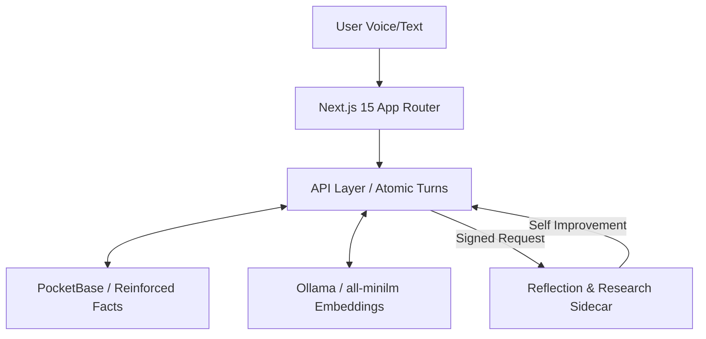

# DigitalMiniTwin / التوأم الرقمي المصغر

> [EN] A cinematic full-stack AI digital twin with memory, adaptive learning, local LLM support, and immersive Sci-Fi UI. Now hardened with the **Cognitive Meta Loop** for autonomous research and skill evolution.
> 
> [AR] توأم رقمي ذكاء اصطناعي سينمائي متكامل مع الذاكرة، التعلم التكيفي، دعم النماذج اللغوية المحلية، وواجهة خيال علمي غامرة. تم تعزيزه الآن بـ **الحلقة الإدراكية الكبرى** للبحث المستقل وتطوير المهارات.


---

## 🚀 The Cognitive Meta Loop / 🚀 الحلقة الإدراكية الكبرى

[EN] We've evolved the architecture into a self-improving, research-aware autonomous system:
- **Project-Researcher**: Automatically ingests intelligence from arXiv and GitHub based on your current focus.
- **Skill Evolution**: Analyzes successful interaction traces and generalizes them into reusable Skill Drafts.
- **Ambient Companion**: A smart UI (PresenceOrb) that visualizes research and improvement cycles via the "Work Report".

[AR] لقد قمنا بتطوير الهندسة المعمارية إلى نظام مستقلاً ذاتي التطور والبحث:
- **الباحث الذاتي (Project-Researcher)**: يقوم تلقائياً بجلب المعلومات والذكاء من arXiv و GitHub بناءً على تركيزك الحالي.
- **تطور المهارات (Skill Evolution)**: يحلل تفاعلاتك الناجحة ويحولها إلى مسودات مهارات قابلة لإعادة الاستخدام.
- **المرافق المحيط (Ambient Companion)**: واجهة ذكية (PresenceOrb) تعرض دورات البحث والتحسين عبر "تقرير العمل".

---

## 🧠 Neural Infrastructure / 🧠 البنية التحتية العصبية

### Advanced Memory Engine / محرك الذاكرة المتقدم
- **[EN] Semantic Deduplication**: Uses vector embeddings to prevent persona drift.
- **[AR] إزالة التكرار الدلالي**: يستخدم التضمينات المتجهية لمنع انحراف الشخصية.
- **[EN] Categorical Reinforcement**: Higher stability for frequently reinforced facts.
- **[AR] التعزيز الفئوي**: استقرار أعلى للحقائق التي يتم تعزيزها تكراراً.

### Atomic Persistence / الاستمرارية الذرية
- **[EN] Idempotent Turns**: Every chat cycle is tracked via a Turn Envelope to prevent race conditions.
- **[AR] محادثات غير متكررة (Idempotent)**: يتم تتبع كل دورة دردشة عبر غلاف (Turn Envelope) لمنع التداخلات.
- **[EN] Cryptographic Bridge**: Sidecar communication secured via HMAC-SHA256 signatures.
- **[AR] الجسر المشفر**: تأمين الاتصال مع الـ Sidecar عبر توقيعات HMAC-SHA256.

---

## 📐 Architecture Flow / 📐 تدفق الهندسة المعمارية



---

## 💻 Tech Stack / 💻 التقنيات المستخدمة

| Layer / الطبقة | Technology / التقنية |
|---|---|
| **Frontend / الواجهة** | Next.js 15, React 19, Tailwind CSS v4, Motion |
| **Logic / المنطق** | TypeScript (Strict), Zod |
| **Database / القاعدة** | PocketBase (Local-first) |
| **Local AI / الذكاء المحلي** | Ollama (Gemma 4 / all-minilm) |
| **Orchestrator / المنسق** | Go Sidecar (Goroutines Workers) |

---

## ⚡ Getting Started / ⚡ ابدأ الآن

### 1. Clone & Install / التحميل والتثبيت
```bash
git clone https://github.com/Moeabdelaziz007/digitaltwin-local-agent.git
cd digitaltwin-local-agent
pnpm install
```

### 2. Configure Environment / إعداد البيئة
```bash
cp .env.example .env.local
```
> [EN] Ensure you set `ENABLE_COREPACK=1` in your environment to support pnpm 10 correctly in CI/Vercel.
> [AR] تأكد من تعيين `ENABLE_COREPACK=1` في إعداداتك لضمان دعم pnpm 10 بشكل صحيح في بيئات البناء (Vercel).

### 3. Launch / التشغيل
```bash
pnpm dev
```

---

## 🔑 Key Environment Variables / 🔑 المتغيرات الأساسية

| Variable / المتغير | Purpose / الغرض |
|---|---|
| `POCKETBASE_URL` | PB Data Layer Address / عنوان لطبقة بيانات PB |
| `CLERK_SECRET_KEY` | Identity & Auth / الهوية والتحقق |
| `SIDECAR_SHARED_SECRET` | HMAC Security Key / مفتاح أمان HMAC |
| `OLLAMA_URL` | Local LLM Node / عقدة الذكاء اللغوي المحلية |

---

## 🗺 Roadmap / 🗺 خارطة الطريق

- [x] Contextual memory & Semantic extraction / الذاكرة السياقية والاستخراج الدلالي
- [x] HMAC-signed Sidecar security bridge / جسر أمان Sidecar مشفر
- [x] Cognitive Meta Loop (Research + Evolution) / الحلقة الإدراكية الكبرى (البحث + التطور)
- [ ] Fully visual Memory Map interface / واجهة خريطة الذاكرة البصرية بالكامل
- [ ] Admin Observability panel / لوحة مراقبة النظام للمسؤول

---

## 🛠 Contributing / 🛠 المساهمة
[EN] Ensure you run `pnpm verify` before proposing any architectural merges.
[AR] تأكد من تشغيل `pnpm verify` قبل اقتراح أي دمج للهندسة المعمارية.

## 📄 License / 📄 الترخيص
MIT License / ترخيص MIT.
