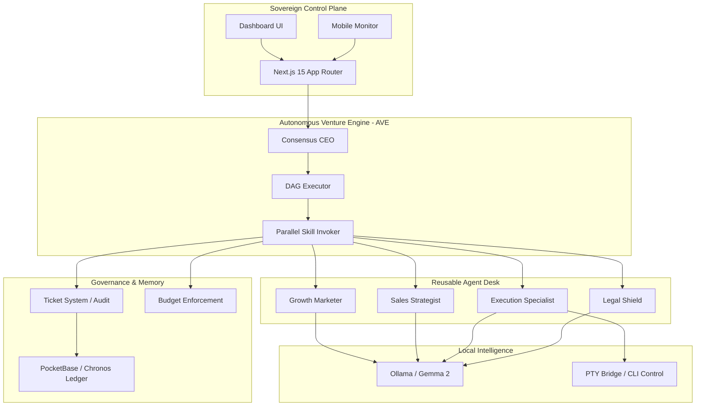

<p align="center">
  
</p>

<p align="center">
  <a href="#-quickstart">Quickstart</a> · <a href="docs/architecture.md">Docs</a> · <a href="https://github.com/Moeabdelaziz007/digitaltwin-local-agent">GitHub</a> · <a href="#-credits">Credits</a>
</p>

<p align="center">
  <b>🚀 Status: Operational Alpha (v1.1.0)</b><br/>
  <b>MIT License · ★ 2.4k · Active Development</b>
</p>

<p align="center">
  
  
  
  
</p>

***

# 🤖 MAS-ZERO: The Autonomous Holding Protocol
### *Open-Source Orchestration for Zero-Human Venture Portfolios*
### *أوركسترا مفتوحة المصدر لإدارة محافظ المشاريع ذاتية التشغيل*

**If OpenClaw is an employee, MAS-ZERO is the Holding.**  
**إذا كان OpenClaw هو الموظف، فإن MAS-ZERO هو الشركة القابضة.**

MAS-ZERO is a modern Local-First AI venture engine built with Next.js 15, Go sidecars, PocketBase, LiveKit, Clerk, and local LLMs. It orchestrates specialized agents, enforces budgets, and keeps sensitive workflows private.

MAS-ZERO هو محرك مشاريع ذكي محلي الأولوية مبني بـ Next.js 15، Sidecar بلغة Go، PocketBase، LiveKit، Clerk، ونماذج محلية. يدير وكلاء متخصصين، يطبق حدود الميزانية، ويحافظ على خصوصية العمليات.

---

## ⚡ Step-by-Step Logic | آلية العمل

| Step | Action | English | العربية |
| :--- | :--- | :--- | :--- |
| **01** | **Define** | Identify a market gap (e.g., "AI-Powered SEO tool"). | تحديد فرصة في السوق (مثلاً: أداة SEO مدعومة بالذكاء الاصطناعي) |
| **02** | **Hire** | Deploy CEO, Marketers, Engineers, and Sales agents. | نشر وكلاء المدير التنفيذي، التسويق، الهندسة، والمبيعات |
| **03** | **Run** | Approve strategy, set budgets, and hit **GO**. | اعتماد الإستراتيجية، تحديد الميزانية، ثم بدء التشغيل الآلي |

---

## 🏗️ Architecture | المعمارية التقنية



---

## ✨ Features | المميزات الذكية

- **🔌 Bring Your Own Agent**: Any runtime, one org chart. (OpenClaw, Claude Code, Codex).  
  **🔌 وظف أي وكيل**: أي بيئة تشغيل، هيكل تنظيمي واحد.
- **🎯 Goal Alignment**: Tasks trace back to the mission; no aimless loops.  
  **🎯 محاذاة الأهداف**: كل مهمة مرتبطة برؤية المشروع.
- **💰 Cost Control**: Hard token budget limits and per-agent spending caps.  
  **💰 التحكم بالتكلفة**: حدود صارمة على ميزانية التوكن لكل وكيل.
- **🛡️ Governance**: Board-style approvals, overrides, and pause controls.  
  **🛡️ الحوكمة**: أنت مجلس الإدارة، مع إمكانية الاعتراض والإيقاف.
- **🏢 Multi-Venture**: One deployment supports many isolated companies.  
  **🏢 مشاريع متعددة**: نشر واحد يدعم شركات متعددة مع عزل تام.
- **🎙️ Voice-First**: LiveKit voice sessions plus local sidecar speech orchestration.  
  **🎙️ صوت أولاً**: جلسات صوت LiveKit مع تنسيق الصوت المحلي.
- **📦 PocketBase Memory**: Local session history, audits, and user persistence.  
  **📦 ذاكرة PocketBase**: تاريخ الجلسات، التدقيق، والتخزين المحلي.
- **🔐 Privacy Guard**: PII detection and local model fallback via Ollama/Gemma.  
  **🔐 حماية الخصوصية**: كشف المعلومات الحساسة وتنفيذ محلي.
- **🧠 Skill Registry**: Modular skills like Growth Marketer, PR Submitter, and SaaS Factory.  
  **🧠 سجل المهارات**: مهارات قابلة للتوسيع مثل التسويق والنشر الذكي.
- **🧪 Simulation**: Market and audit simulations before execution.  
  **🧪 المحاكاة**: محاكاة السوق والتدقيق قبل التنفيذ.

---

## 📁 Project Structure | هيكل المشروع

- `src/` — Next.js app, API routes, skill registry, conversation engine, and orchestration logic.  
  `src/` — تطبيق Next.js، مسارات API، سجل المهارات، محرك المحادثة، ومنطق التنسيق.
- `sidecar/` — Go sidecar runtime for speech, desktop observation, and local execution.  
  `sidecar/` — منفذ Go لتنفيذ الصوت، المراقبة، والتشغيل المحلي.
- `pb_schema.json` — PocketBase schema and access rules for private user storage.  
  `pb_schema.json` — مخطط قواعد الوصول الخاصة بـ PocketBase.
- `docs/` — architecture, security, roadmap, contributing, and Browserbase guides.  
  `docs/` — وثائق المعمارية، الأمن، خريطة الطريق، المساهمة، ودليل Browserbase.
- `scripts/` — env checks, contract generation, smoke tests, and quality gates.  
  `scripts/` — فحوصات البيئة، توليد العقود، اختبارات التنفس، وبوابات الجودة.
- `public/` — offline page, manifest, and documentation assets.  
  `public/` — صفحة عدم الاتصال، تعريف التطبيق، وأصول التوثيق.
- `plugins/` — developer workbench and plugin integration points.  
  `plugins/` — بيئة تطوير إضافية ونقاط تكامل المكونات الإضافية.
- `README_CONTRIBUTORS.md` — contributor guide for sidecar and native dependency setup.  
  `README_CONTRIBUTORS.md` — دليل المساهمين لإعداد Sidecar والاعتماديات.
- `.github/agents/deep-docs-review.agent.md` — workspace custom agent definition.  
  `.github/agents/deep-docs-review.agent.md` — تعريف وكيل مخصص للمستودع.
- `/home/codespace/.vscode-remote/data/User/prompts/deep-docs-review.agent.md` — user-level agent prompt file for local Copilot testing.  
  ملف وكيل المستوى الشخصي للاختبار المحلي في Copilot.

---

## 📚 Docs Snapshot | لمحة عن الوثائق

- `docs/architecture.md` — Local-first architecture, sidecar swarm, and security model.  
  `docs/architecture.md` — المعمارية المحلية، مجموعة Sidecar، ونموذج الأمن.
- `docs/SECURITY.md` — privacy-first controls, PII handling, and data storage guidance.  
  `docs/SECURITY.md` — التحكم في الخصوصية، التعامل مع المعلومات الحساسة، وإرشادات التخزين.
- `docs/CONTRIBUTING.md` — contribution flow, Clerk auth webhooks, and code review process.  
  `docs/CONTRIBUTING.md` — سير المساهمة، Webhook للتحقق من Clerk، وعملية المراجعة.
- `docs/roadmap.md` — milestone plan, sidecar execution phases, and future expansion.  
  `docs/roadmap.md` — خطة المعالم، مراحل Sidecar، والتوسع المستقبلي.
- `BROWSERBASE_GUIDE.md` — Browserbase proxy setup and session lifecycle.  
  `BROWSERBASE_GUIDE.md` — إعداد بروكسي Browserbase ودورة حياة الجلسات.
- `README_CONTRIBUTORS.md` — native sidecar build notes, FFmpeg, Whisper, and model setup.  
  `README_CONTRIBUTORS.md` — ملاحظات بناء Sidecar، FFmpeg، Whisper، وإعداد النماذج.

---

## 🚀 Quickstart | ابدأ هنا

### English
```bash
# 1. Clone the Sovereign Engine
git clone https://github.com/Moeabdelaziz007/digitaltwin-local-agent.git
cd digitaltwin-local-agent

# 2. Install & setup
npm install
cp .env.example .env.local

# 3. Pull local Ollama brain
ollama pull gemma2:9b

# 4. Launch the holding engine
npm run dev
```

### العربية
```bash
# 1. انسخ المشروع
git clone https://github.com/Moeabdelaziz007/digitaltwin-local-agent.git
cd digitaltwin-local-agent

# 2. ثبّت الحزم وجهز المتغيرات
npm install
cp .env.example .env.local

# 3. حمّل نموذج Ollama محليًا
ollama pull gemma2:9b

# 4. شغّل المشروع
npm run dev
```

---

## 🧪 Testing & Maintenance | الاختبار والصيانة

- `npm run typecheck` — TypeScript validation.  
  `npm run typecheck` — التحقق من أنواع TypeScript.
- `npm run lint` — lint and code quality checks.  
  `npm run lint` — فحوصات جودة الكود.
- `npm run verify` — environment and quality gate validation.  
  `npm run verify` — التحقق من البيئة وجودة المشروع.
- `npm test` — run Vitest test suite.  
  `npm test` — تشغيل مجموعة اختبارات Vitest.

---

## 👤 Credits | صاحب المشروع

<table width="100%">
  <tr>
    <td align="center" width="100%">
      <a href="https://github.com/Moeabdelaziz007">
        
        <br />
        <sub><b>Moe Abdelaziz (@Moeabdelaziz007)</b></sub>
      </a>
      <br />
      <b>Principal System Architect & AI Pioneer</b><br />
      <i>"Building the future of autonomous value creation."</i><br />
      <a href="https://github.com/Moeabdelaziz007">Follow on GitHub</a>
    </td>
  </tr>
</table>

---

## 🗺️ Roadmap | خريطة الطريق

- [x] Autonomous Venture Engine (AVE) Core  
  ✅ المحرك الأساسي للمشاريع الذاتية.
- [x] The 6 Revenue Rivers (Alpha)  
  ✅ ستة مجالات دخل أولية.
- [x] Immutable Ticket System  
  ✅ نظام تذاكر غير قابل للتعديل.
- [ ] **MAXIMIZER MODE** (Self-scaling budgets)  
  ❗ وضع تحسين الميزانية الذاتي.
- [ ] **Clipmart** (One-click company templates)  
  ❗ قوالب شركات بنقرة واحدة.
- [ ] **Desktop Bridge** (Screen-aware proactive help)  
  ❗ جسر سطح المكتب للمساعدة الاستباقية.

---

<p align="center">
  <i>Engineered for Profit. Optimized for Sovereignty.</i><br />
  <b>2026 Venture Lab :: MAS-ZERO v1.1.0</b>
</p>
