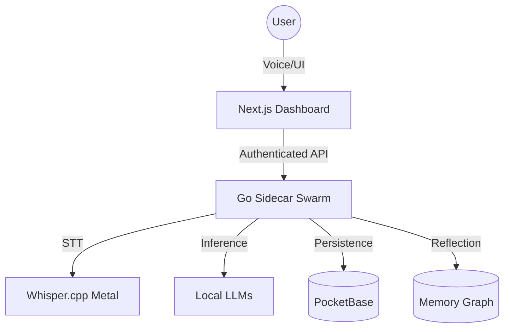

# DigitalMiniTwin 🛸

**Architecting a Private, Voice-First AI Digital Twin. Built for the Edge.**

<!-- START_BADGES -->


<!-- END_BADGES -->

## ⚡ The Vision
DigitalMiniTwin is not just a chatbot; it is a **Presence Layer** for your digital life. It observes, proposes, and acts entirely within your local environment.

- **Observe**: Ambient context and real-time voice capture.
- **Propose**: Intelligent, non-intrusive action suggestions.
- **Act**: One-click execution of complex agentic tasks.

---

## 🏗️ Architecture
DigitalMiniTwin leverages a high-performance **Go Sidecar Swarm** to handle heavy AI tasks, keeping the **Next.js Frontend** light and responsive.



---

## 🌎 English Overview
A state-of-the-art, local-first AI digital twin platform. It features a private voice-first pipeline, an ambient "Mini Twin" presence layer, and a scalable memory graph. Built to protect privacy while providing deep agentic assistance, it runs primarily on-device using Whisper.cpp and Ollama.

## 🌍 نظرة عامة (العربية)
منصة توأم رقمي ذكي متطورة تعمل محلياً بالكامل. يتميز بنظام معالجة صوتي خاص، وطبقة حضور مصغرة (Mini Twin)، وذاكرة رسومية ذكية. صُمم المشروع لحماية الخصوصية مع تقديم دعم ذكي عميق، حيث يعتمد في تشغيله الأساسي على معالجات محلية مثل Whisper.cpp و Ollama.

---

## 💎 Key Features
- **Presence Swarm (Gem #1)**: Real-time WebRTC audio & avatar integration via LiveKit.
- **Cognitive Memory (Gem #3 & #6)**: 
  - **Ebbinghaus Forgetting Curve**: Simulated biological memory decay to prioritize high-impact facts.
  - **Tool Calling**: Autonomous memory management (recall/save) during live interactions.
- **Cognitive Automation (Crons)**:
  - **Daily Decay**: Daily memory pruning of low-confidence facts.
  - **Weekly Snapshots**: Automatic weekly aggregation of a user's "Long-Term Memory".

---

## 🛠️ Quick Start

### 1. Requirements
- macOS (Intel/M-series) or Linux.
- [Ollama](https://ollama.ai/) installed and running.
- [PocketBase](https://pocketbase.io/) for local-first persistence.
- (Optional) Docker for local LiveKit server.

### 2. Setup
```bash
# 1. Install Dependencies
npm install

# 2. Setup Environment
# Create .env and add:
# POCKETBASE_URL=http://localhost:8090
# OLLAMA_URL=http://localhost:11434
# CRON_SECRET=your_secret_here

# 3. Start the Dashboard (Turbopack Enabled)
npm run dev
```

### 3. Presence Activation (Advanced)
If using the WebRTC presence layer:
```bash
# Start LiveKit
docker compose up -d

# Start Python Agent
cd sidecar/python
pip install -r requirements.txt
python agent.py dev
```

---

## 🔒 Security & Privacy
- **Local-Only**: No audio or text data ever leaves your device by default.
- **Secret Hygiene**: Comprehensive `.gitignore` prevents leaks of keys or models.
- **OPA Boundaries**: Every action requires explicit user consent through the "Gate".

---

## 📂 Project Structure
- `src/`: Next.js frontend assets & OPA UI components.
- `sidecar/`: Go-based swarm services (Voice, Memory, LLM).
- `docs/`: Technical deep-dives and roadmaps.
- `scripts/`: Automation for environment setup.

---

## 🤝 Contributing
Interested in building the future of local AI? Check out [CONTRIBUTING.md](./docs/CONTRIBUTING.md).

## 📄 License
MIT License - Copyright (c) 2026 **Mohamed Hossameldin Abdelaziz** (@Moeabdelaziz007)
