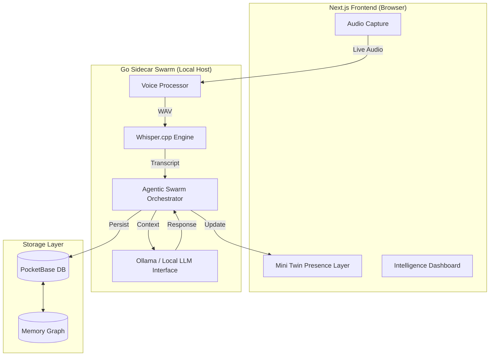

# DigitalMiniTwin Architecture

DigitalMiniTwin is built on a **Local-First / Private-First** philosophy. It utilizes a distributed architecture consisting of a modern Next.js frontend and a performant Go-based sidecar for heavy lifting.

## System Overview

## Core Components

### 1. Mini Twin Presence Layer
The "Face" of the AI. A floating, draggable "Orb" that lives on top of the user's dashboard. It follows the **OPA (Observe, Propose, Act)** lifecycle.
- **Observe**: Monitors ambient context or direct voice input.
- **Propose**: Suggests actions or thoughts via a non-intrusive UI.
- **Act**: Executes confirmed tasks or long-running workflows.

### 2. Go Sidecar Swarm
Communicates with the Next.js app via authenticated API requests. It handles:
- **Local STT**: Low-latency transcription via `whisper.cpp`.
- **Memory Reflection**: Batching thoughts and experiences into the Memory Graph.
- **Tool Orchestration**: Interfacing with local system tools or external APIs.

### 3. Local Intelligence
By default, DigitalMiniTwin steers clear of cloud dependencies:
- **Ollama**: Orchesrating local models (Gemma 2, Llama 3).
- **PocketBase**: A lightweight, single-binary database for all personal data.
