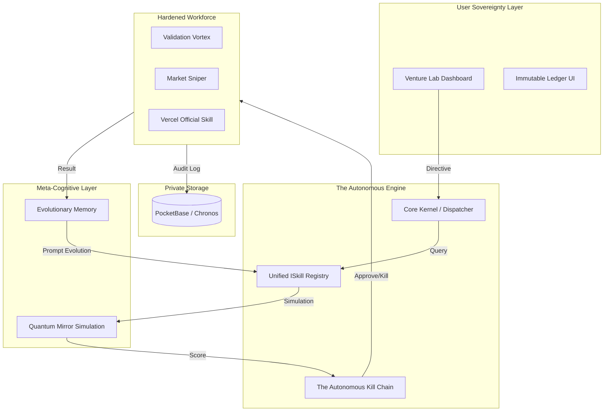

# MAS-ZERO Architecture: The Autonomous Holding Protocol (AHP)

MAS-ZERO is built as a **Sovereign, Local-First Operating System** for venture portfolios. It shifts away from simple task-agents to a robust "Holding Company" architecture.

## System Overview

## Core Architectural Pillars

### 1. Unified ISkill Interface
All system capabilities are encapsulated as "Skills". Each skill follows a strict 6-stage lifecycle (**Scan -> Score -> Generate -> Execute -> Verify -> Learn**). This ensures that no agent runs without risk assessment or verification.

### 2. The Autonomous Kill Chain (Shadow Board)
The governance layer of MAS-ZERO. It acts as an automated board of directors that:
- **Confidence Decay**: Reduces task priority over time.
- **Budget Cannibalism**: Reallocates capital from failing skills to high-performers.
- **Betrayal Protocol**: Protects the system from human emotional bias.

### 3. Evolutionary Memory (Genetic Prompts)
Unlike static memory, MAS-ZERO treats instructions as **DNA**. 
- **Crossover**: Merges successful prompt strategies.
- **Mutation**: Randomly tests new constraints for failing agents.
- **Tournament**: Nightly simulations determine which "Prompt DNA" survives to the next generation.

### 4. Validation Vortex
A high-velocity market funnel that automates the "Ideation to MVP" pipeline. It enforces a strict 5-day rule to validate niches or kill them immediately, preserving capital for high-potential ventures.

## Technology Stack
- **Frontend**: Next.js 15 (App Router, Tailwind 4).
- **Orchestration**: Node.js/TypeScript Core Kernel.
- **Local Brain**: Ollama (Gemma 2, Llama 3).
- **Persistence**: PocketBase (Single-binary private DB).
- **Sidecars**: Go-based services for desktop/voice interaction.
