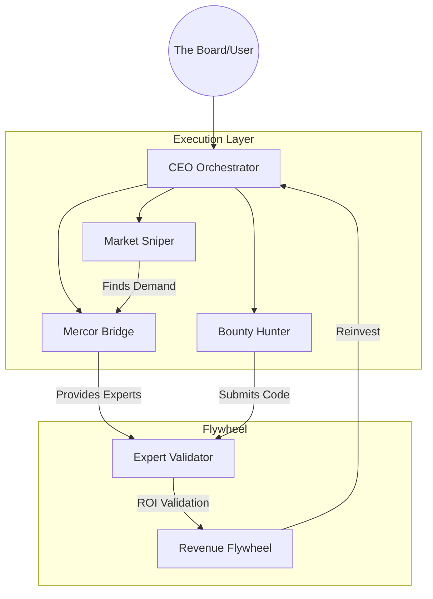

# 🤖 MAS-ZERO Workforce Tree

The hierarchical architecture of the Autonomous Venture Holding workforce.

## 1. Market Sniper (The Hunter)
- **Role**: Opportunity Discovery.
- **Goal**: Scan X, LinkedIn, and Job boards for high-value needs.
- **Output**: Market Leads + Proposal Drafts.

## 2. Mercor Bridge (The Matchmaker)
- **Role**: Expertise Fulfillment.
- **Goal**: Connect leads from the Sniper to vetted human experts on Mercor.
- **Output**: Affiliate Revenue (20%) + Expert Validation.

## 3. Bounty Hunter (The Executioner)
- **Role**: Technical Output.
- **Goal**: Solve GitHub bounties and build micro-SaaS features.
- **Output**: Code PRs + Bounty Payments.

## 5. Mirage Protocol (The Ghost)
- **Role**: Stealth Evasion & Browser Sync.
- **Goal**: Connect agents to real human browser sessions via CDP to bypass X/LinkedIn anti-bot shields.
- **Output**: Undetectable Market Discovery + Zero API Costs.
